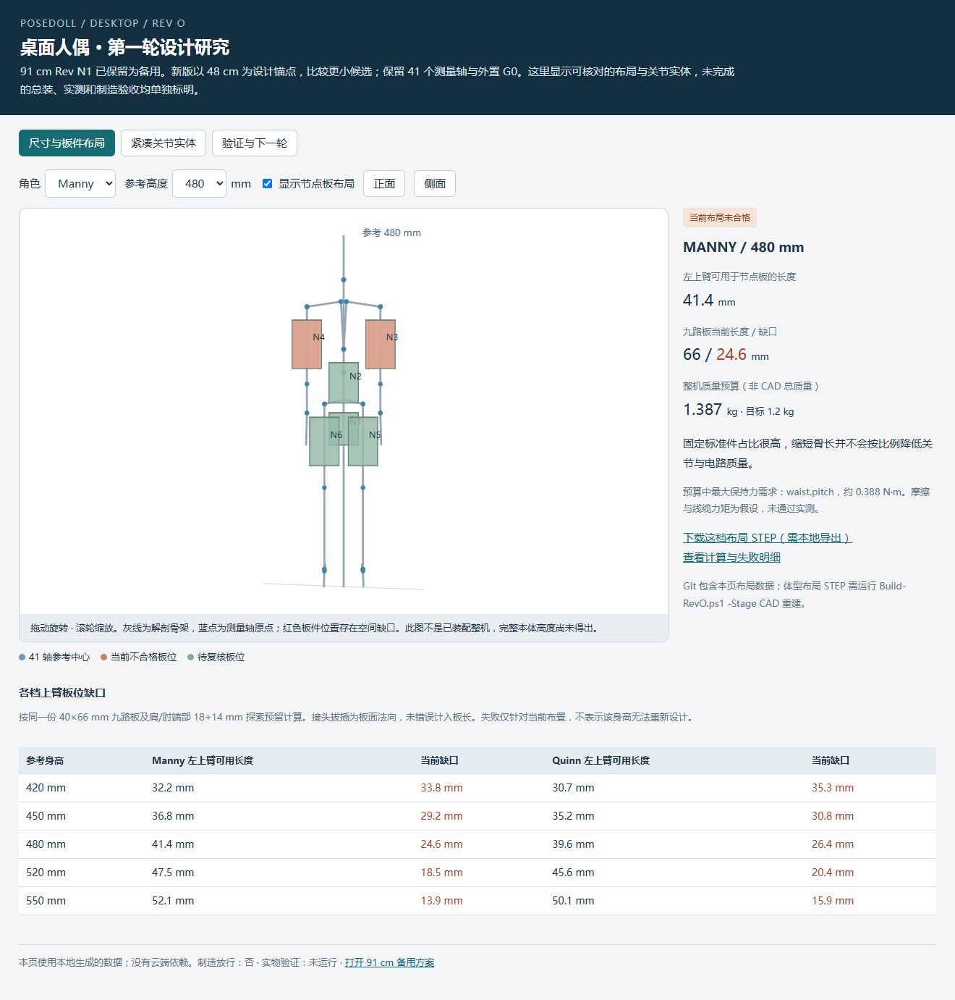
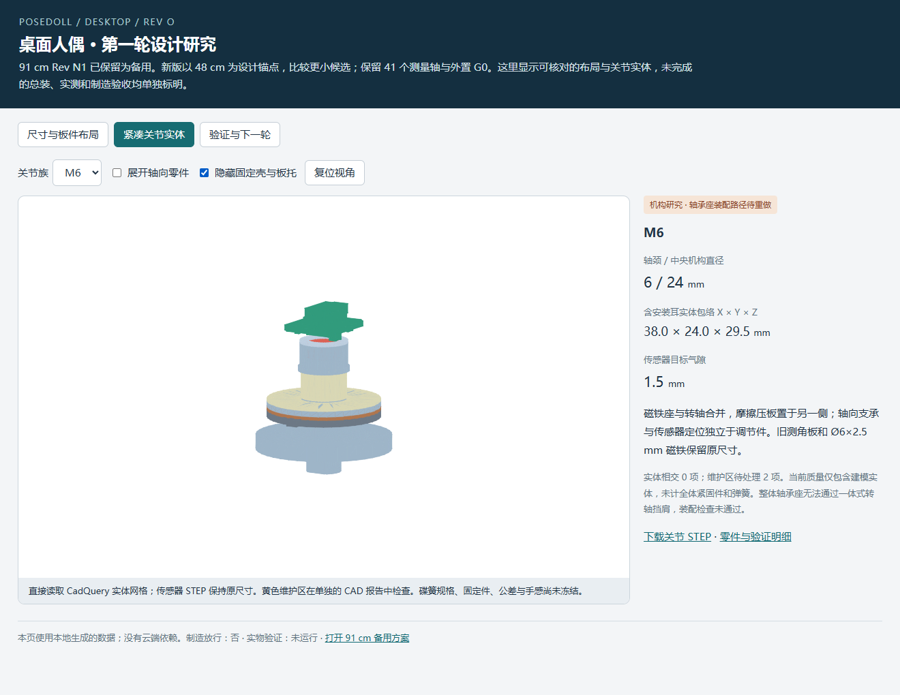

# Rev O 第一轮：给 GPT-6 Pro 的设计审查说明

日期：2026-09-23。审查分支：`design/revO-desktop-external`。本轮基于 `458f3b0646f724f3b74769defc98f5f6e9ec45a8`，完整提交号请以所审查分支的 Git HEAD 为准。

**这是带有明确失败项的设计研究快照，完整整机数字验收尚未通过，也未制造放行。此次提交先固定当前证据，等待独立审查后再开展下一轮机构与电路重设计。**

## 可直接交给网页端的任务

> 请审查当前分支的 PoseDoll Rev O 桌面人偶设计。先读本文件和所链接的源码、配置及原始报告，确认读取的提交号；不要只根据概述推断设计已经完成。
>
> 目标是给本地 Codex 一份可实施的下一轮修改方案：指出最关键的结构或电气问题，提出有尺寸、装配顺序、载荷/电气约束依据的改法，并给出修改文件与验收步骤。既要检查本文列出的失败项，也要独立查找尚未识别的问题。需要推翻当前局部方案时请直接说明理由。
>
> 约 91 cm 的 Rev N1 保持为备用。保留 41 个测量轴、44 个协议槽及既定动作需求；以 480 mm 解剖参考为锚点探索更小且可实现的人偶。不能通过缩放标准件、删减测量轴、降低检查标准或把未执行项改成 PASS 来获得合格结果。
>
> 每条结论区分“已有证据”“有条件的推算”“尚待建模或实测”。引用仓库文件、字段或代码位置；选用新器件时引用厂家资料，并说明型号、尺寸及适用条件。若无法访问文件或执行 CAD/固件工具，请明确阅读范围，不把推断写成已验证。
>
> 最终请返回：优先级问题表、关键方案对比与推荐、带依赖顺序的改动清单、下一轮数字验收门槛，以及只有用户才能决定的取舍。先交付审查意见和具体修改建议。

## 约束与证据边界

- **尺寸**：完整中立姿态本体必须 ≤600 mm；480 mm 是解剖参考高度，其完整本体目标 ≤500 mm。当前比较 420/450/480/520/550 mm，尚未选定合格尺寸。520/550 mm 只是较大比较档，不能用直接放大替代紧凑化设计。
- **质量**：本体含六块采集板、内部线束、接头及全部结构，目标 ≤1.2 kg；外置 G0 与外接线缆分列。目前是预算，尚无完整 CAD 总质量或实称结果。
- **测量和动作**：41 个测量轴，加骨盆 3 个固定参考槽，保持 44 槽语义、顺序和所需动作。Manny/Quinn 各用自身比例，硬件实体不能跟随解剖骨长全局缩放。
- **架构**：G0 外置且不采样；N1–N6 均留在本体，通道数为 3/6/9/9/7/7。N1 仍测三路腰轴；七个物理 CAN 节点、六份测量记录。去除大背包，板件与线束要能真实装配、维护和随动。
- **传感器**：当前沿用 AS5048A 和直径充磁 Ø6×2.5 mm 磁铁。气隙、轴承基准与摩擦预紧分别控制；预紧载荷应由金属结构承担。更改选型需量化收益及重新验证的代价。
- **通信和供电**：CAN 500 kbit/s、60 Hz、节点采样 8 ms/批次 14 ms 仍是待验证目标。5 V/12 V 需比较全链路；旧 5 V 板禁止直接接 12 V。两端端接、六路内部支路保护及 USB 防回灌都需要明确实现。
- **实物**：目前仅 A01/A02 配合样片可作打印尺寸试验；单关节 B 级及后续样件未放行。供应方承担精密加工、PCBA、微型装配与压接。

[原始任务书 JSON](../mechanical_manifest/revO_requirements_source.json) 是网页讨论时的**需求快照**，其中 `new_*_delivered: false` 等字段描述提出需求时的状态，并非本轮结果。当前结果看 [status.json](../verification/revO/status.json)。

## 优先审查的问题

| 编号 | 已有证据及含义 | 希望审查给出的具体改进 |
| --- | --- | --- |
| O-01 板件布置 | 当前九路板 40×66 mm；肩/肘端部探索预留 18+14 mm 后，480 mm Manny 左上臂可用约 41.4 mm，缺 24.6 mm；Quinn 缺 26.4 mm。五档均未通过此布置检查。 | 对比控制板/端口板拆分、移入刚性躯干及其他真实封装方案。列实际器件、连接器、线缆跨关节路径、SPI 长度/信号完整性和维护代价；不能只画更小空板。 |
| O-02 关节装不进去 | S4 整体座孔 Ø6 mm，一体转轴凸台需 Ø8.4 mm；M6/L6 座孔 Ø8 mm，挡肩需 Ø9 mm。实体零相交并不表示装配可行。 | 比较分体轴承座/可拆轴承盒与可靠防脱的可拆挡肩；给出装配顺序、载荷闭合路径、轴向定位、公差及工具到达方式。 |
| O-03 预紧与手感 | 480 mm Manny 载荷分配模型中，腰俯仰需约 0.388 N·m 保持力矩（含假设线缆力矩、1.5 倍裕量）；假设 μ=0.08 时需约 555 N，超过 L6 当前探索上界 350 N。锁骨抬升 M6 也超出当前上界。 | 复核质量分布与力矩推算；比较摩擦半径、摩擦副/面数、弹簧曲线及材料。分别说明持姿、起动力、轴承负担、调节范围及磨损后的表现。 |
| O-04 质量预算 | 约 762 g 关节建模实体子集 + 625 g 未建模分配 = 约 1.387 kg，超过目标约 187 g。尺寸档间固定标准件占比高。 | 给出按部件/材料落实的减重路线，保留弹簧、紧固件、线束、板件及装配结构。复核传感器封装等当前简化密度；不能只降低分配数字。 |
| O-05 PCB 未完成 | 五种板 ERC 均通过错误级检查；DRC 全部 FAIL，尚未布线；每板另有 12 项 0.2 mm 散热过孔不满足当前 0.3 mm 最小钻孔规则。 | 确认板厂工艺与散热焊盘实现，再完成布线、完整 ERC/DRC、电源保护、调试/烧录与连接器设计；不能无依据降低规则消除报错。 |
| O-06 维护与紧固 | 每档关节两项维护区交叠：后端工具区穿过输出轴，插头保留区与配合连接器相交。弹簧、磁铁压盖防脱、板边夹持和螺纹公差未定型。 | 用真实工具、配合插头和线尾模型区分必要配合与不可接受干涉；落实紧固结构、拆装路线及防松。 |
| O-07 整机与动作 | 当前是解剖骨架、候选板位和独立单轴关节，肩/髋/腕嵌套机构、真实机械轴偏置、完整包络和动作路径尚未完成。 | 安排单关节→多轴→单臂→整机的建模顺序；定义带线动作、插拔工具和接触支撑检查。不能将骨架球点当作最终机械轴。 |
| O-08 电气与时序 | CAN 粗算占用 48.6%，理想调度约 11.49 ms；未含全部 SDK/调度/重试/BOOT/ACK。5 V/24 AWG 只是分配模型下的临时基线，尚无实物电源验证。 | 复核峰值电流、压降、内部支路、保护、端接/支线与线缆力矩；为真实 8/14 ms 和完整新鲜批次指标制定可执行台架测试。 |

O-01 是**当前板位失败**，不能直接推出 480 mm 或更小人偶不可行。O-03 的摩擦系数和电缆力矩为假设，尚无合格的弹簧选型、力矩或手感测试。

## 建议阅读顺序和源码入口

以下链接均相对本文件，可在远端仓库阅读。

| 阅读内容 | 文件 |
| --- | --- |
| 当前交付、失败项与下一步 | [START_HERE](START_HERE_REVO.zh-CN.md)、[状态总表](../verification/revO/status.json) |
| 独立参数与网络 | [desktop_revO.json](../mechanical_manifest/desktop_revO.json)、[network_revO.json](../mechanical_manifest/network_revO.json) |
| 关节几何、装配与实体检查 | [compact_joint.py](../cad/revO/compact_joint.py)、[export_joints.py](../cad/revO/export_joints.py)、[joint_study.json](../verification/revO/joint_study.json) |
| 三档 CAD 快照 | [S4 STEP](../generated/revO/joints/S4/S4_joint_study.step)、[M6 STEP](../generated/revO/joints/M6/M6_joint_study.step)、[L6 STEP](../generated/revO/joints/L6/L6_joint_study.step) |
| 尺寸、质量和力矩计算 | [study_revo.py](../../../scripts/study_revo.py)、[size_tradeoff.json](../verification/revO/size_tradeoff.json)、[Manny 480 明细](../generated/revO/layouts/manny_480/study.json)、[Quinn 480 明细](../generated/revO/layouts/quinn_480/study.json) |
| PCB 生成及实际封装/网络 | [build_revo_electronics.py](../../../scripts/build_revo_electronics.py)、[九路板工程](../electronics/revO/node_9port/PoseDoll_RevO_N9_placement.kicad_pro)、[九路板布局数据](../electronics/revO/node_9port/layout.json)、[板级检查汇总](../verification/revO/electronics_placement.json) |
| 通信与供电分析 | [can_budget.json](../verification/revO/can_budget.json)、[power_budget.json](../verification/revO/power_budget.json)、[电气说明和厂家来源](WIRING_AND_POWER_REVO.zh-CN.md) |
| G0 实现与状态处理 | [main.c](../../../Firmware/PoseDollFullBody/revO/main/main.c)、[pd41_gateway.c](../../../Firmware/PoseDollFullBody/revO/main/pd41_gateway.c)、[沿用的核心](../../../Firmware/PoseDollFullBody/main/pd41_core.c)、[G0 主机测试](../../../Firmware/PoseDollFullBody/revO/tests/gateway_test.c) |
| 真实测试证据 | [七角色编译](../verification/revO/firmware/builds.json)、[离线回归](../verification/revO/offline/results.json)、[浏览器检查](../verification/revO/browser/checks.json)、[测试计划](TEST_PLAN_REVO.zh-CN.md) |
| 动作目标 | [revO_pose_cases.json](../mechanical_manifest/revO_pose_cases.json)；侧卧/俯卧的空角度字段是待建模标记，不是通过证据 |

板文件名里的 `N9/N7/N6/N3` 表示**板的端口数量**，不是物理节点编号。物理 N3/N4 都用九路布局，映射以 `network_revO.json` 为准。各目录中以 `PoseDoll_RevO_*_placement.kicad_pro/.kicad_pcb` 为当前尺寸的审查对象；`placement.kicad_pcb` 是旧生成器输出的中间文件。

快速视觉参考（骨架布局不是整机）：





## 本轮已执行与尚未执行

- **已通过**：81 个原 Python 测试、13 个 Rev O 测试、9 个原 C 场景及新增 G0 分发故障场景；C/Python PD41 字节一致；七角色 ESP-IDF 编译；五种板的错误级 ERC；已建模关节实体的静态相交检查；查看器浏览器检查。
- **已失败**：PCB DRC、当前上臂板位、质量预算、关节轴向装配和维护区。载荷初算同时指出预紧范围不够，实物保持力/手感尚未测试。
- **尚未执行**：完整多轴与整机装配、带线动作路径、完整本体尺寸/质量、磁干扰、支路保护/回灌/温升、60 Hz 实物长测及 UE 编辑器交互回归。编译通过不证明板件、时序或实物功能通过。
- 旧 91 cm 源码及本地导出共 5,748 个文件有 SHA-256 冻结清单；它是原位校验，不是远端完整备份。

原始失败也保留：`firmware/N1_initial_toolchain_failure.log` 记录早期构建无关 LCD 组件时的编译器内部错误，限制为实际主组件后七角色均成功；`offline/03_initial_launcher_failure.txt` 记录修正命令路径前的测试启动错误。它们不是最终通过记录。

## 在远端能读取什么

本提交包含需求快照、设计源码、原生 KiCad 工程、固件、JSON 结果、截图、实际编译/ERC/DRC 日志、三档关节总成 STEP、两个 A 级样片 STEP/STL，以及轻量查看器的 HTML/网格/布局数据。克隆后可直接运行 `scripts/Start-Viewer.ps1` 查看 Rev O，无需先安装 CAD 工具；本地服务仍需 Python。

十份约 12 MB/份的体型布局 STEP、关节逐零件重复 STEP、旧版大型网格和编译二进制/缓存继续只保留本地。体型布局在 Git 内有完整 `layout_scene.json`/`layout_data.json` 和生成器，可供源码与数值审查；查看器的体型布局 STEP 下载需要先重建。GitHub 文件预览不会直接运行 HTML。

在具备原工具链和旧导出的本机，可运行：

```powershell
.\scripts\Build-RevO.ps1 -Stage OfflineTests
.\scripts\Build-RevO.ps1 -Stage CAD
.\scripts\Build-RevO.ps1 -Stage Electronics
.\scripts\Build-RevO.ps1 -Stage Firmware
.\scripts\Build-RevO.ps1 -Stage Reports
```

本次已初始化。不要为了审查而再次运行 `-Stage Initialize`：该命令是初始派生工具，会重新写入 Rev O 配置及固件入口，并依赖仓库外的原始任务书目录。`-Stage All` 也只是重建当前研究快照，不意味着工程门槛全部通过。

工具链仍含本机路径：CadQuery 2.7 / Python 3.13、KiCad 10、ESP-IDF 6.1、MSVC；查看器 QA 依赖本机 Playwright/Chrome。`OfflineTests` 最后会核验本地备用版的完整 5.16 GB 输出，纯 Git 克隆缺少这些导出会失败，不能把缺文件当成设计改坏，也不能据此跳过后宣称完整基线已通过。在仅有 Git 的环境应明确记录可执行的子集和未执行原因。

报告仍有复现限制值得审查：`report_revo.py` 的若干门槛是本轮显式固定的 FAIL/NOT_RUN，不能自动给未来改进放行；固件报告的 `source_sha256` 只覆盖 `main/`，未覆盖全部工具链与构建配置；离线验证器在前一命令失败后仍继续运行，后续金样检查有复用旧产物的可能。现有最终整轮记录均成功，但下一轮应完善这些证据链。

## 希望返回的修改方案格式

1. **问题表**：优先级、证据位置、触发条件、影响、修法、验收方法；新发现和已知项都要有依据。
2. **方案对比**：至少比较板件架构、可装配关节方案和预紧/减重路线；列关键尺寸、质量增减、线束与加工代价、仍需实测的条件。
3. **下一轮改动顺序**：给出需修改的文件/生成器、应生成的零件/报告以及前置依赖。优先关闭板位和单关节装配，再进入多轴及全身。
4. **分阶段验收**：先证明能装、能拆、能走线，再验证持姿/手感、机械偏置和完整动作；沿用明确阈值，不把单项通过扩大为整机通过。
5. **需用户决定的取舍**：只有涉及原需求变更的选择才列在这里；例如何时允许换控制器/传感器、超出目标尺寸或质量。普通设计实现选择请给出推荐理由。
