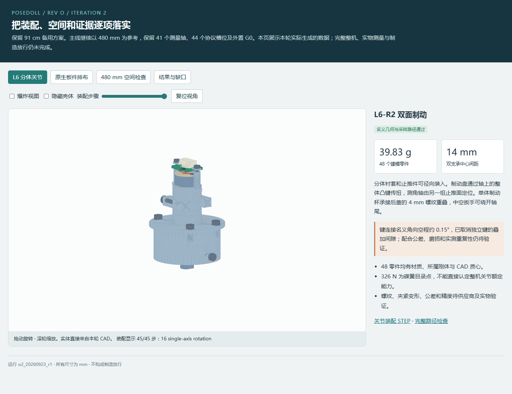
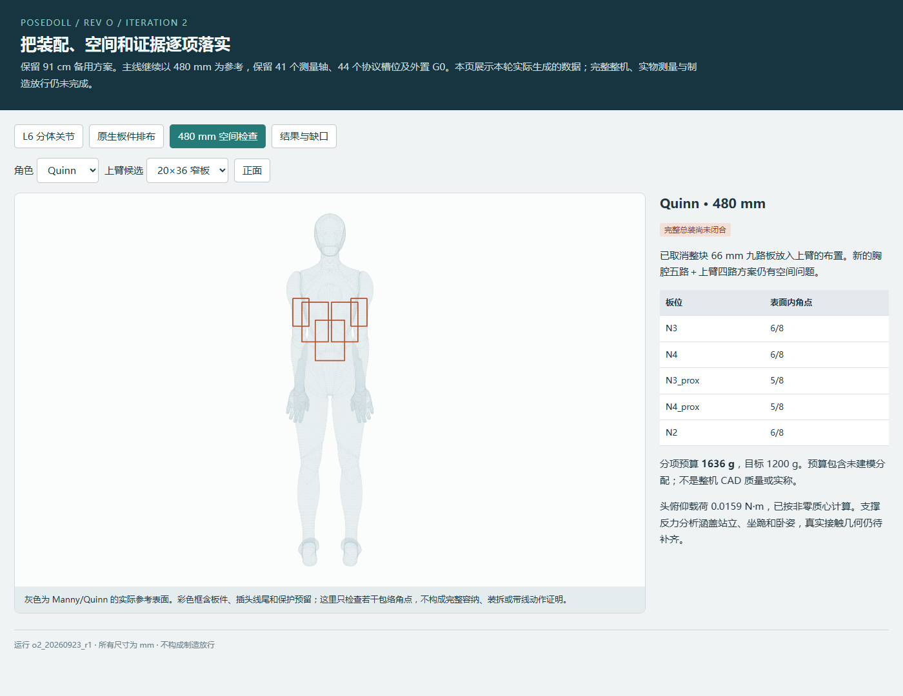

# Rev O 第二轮：给 GPT-6 Pro 的独立审查说明

审查分支：`design/revO-desktop-external`。本轮基于第一轮提交 `f59e4d3a7ea3d0940b1810702cd5e1df181e0364`；固定证据运行 `o2_20260923_r1`。请记录本次实际读取的完整 Git 提交号，不把这里的父提交当作第二轮提交号。

**本次是等待独立审查的设计快照。V0 证据检查通过，V1 部分完成，V2–V5 仍被空间、结构/公差、电气与实物验证阻塞；不是制造版本。**

## 可直接交给网页端的任务

> 请审查这个提交的 PoseDoll Rev O 第二轮设计。先记录实际读取的完整提交号，读取本文件、上一轮审查建议与本轮源码/原始报告；逐项判断 R01–R10 是否真正解决，并独立寻找新问题。
>
> 重点检查 L6 的真实螺纹保持和金属预紧闭环、浮动制动盘与测角基准分离、装拆/工具路径、公差和反向回差；N3/N4 拆板后的完整 PCBA、跨肩线束、胸肩机构和维护空间；质量/COM/接触反力推算；EPOCH/入网恢复与 8/14 ms 时序；证据链是否会给出错误 PASS。
>
> 本轮所有数字通过都有限定范围：离散名义 CAD 路径不等于公差/强度/实物通过，ERC 和编译不等于板件或台架通过，V0 不等于整机通过。请同时检查模型本身和检查器，不只复述结果。
>
> 目标仍是 Manny/Quinn 各自比例、480 mm 解剖参考、完整本体目标 ≤500 mm/硬上限 ≤600 mm、本体目标 ≤1.2 kg、41 个测量轴＋3 个固定槽、六采集节点＋外置 G0。N3/N4 拆板后体内为八块采集 PCB，仍为六采集节点。不要删轴、缩放标准件、放宽阈值或自动放大身高来过关。
>
> 对每条发现标明“源码/报告直接证据”“有条件推算”或“尚待建模/实测”，引用文件与字段/代码位置，说明触发条件和影响。无法运行 CAD/KiCad/ESP-IDF 时明确范围，不声称独立重跑通过。新器件/材料建议应有厂家资料和适用条件。
>
> 请交付：P0/P1 优先级问题表，R01–R10 关闭/部分关闭/未关闭判定，关键方案对比和推荐，下一轮具体改动文件及依赖顺序，数字与实物验收方法，以及只有改变原需求才需要用户决定的取舍。允许推翻本轮局部方案，但应给出可实施替代；不要只提高弹簧力或降低质量预算数字。可以提供下一轮任务书和检查脚本建议，脚本不能替代实际工程验证。

## 当前成果和最重要的失败

| 范围 | 当前事实 | 不应推出的结论 |
|---|---|---|
| L6-R2 | 48 个连通实体；静态名义零相交；45 项路径、867 个采样变换、4094 对 BRep 检查通过 | 尚未证明连续轨迹、公差极值、受载变形、全部紧固工具或可生产性 |
| 后盖/支承 | 单体制动杯；0.75 mm 螺距、3.5 mm 完整参考螺旋；双支承跨度 14 mm；独立轴向定位、浮动盘双面制动 | 螺纹参考几何和条件强度计算不是标准配合/供应商能力证明 |
| 回差 | 整体驱动凸键；名义切向空程 0.008 mm，约 0.15° | 槽加工、表面处理、磨损和带扭矩滑动未验证，不能说重复性 ≤0.3° 已过 |
| 单关节质量/尺寸 | 39.83 g，37.33×34.06×49.65 mm；同部件减重对照 42.92→39.83 g | 第一轮 23.60 g 未含全部弹簧/紧固件且机构有缺陷，不能当作等功能成品直接对比 |
| N3/N4 新原生板 | 近端 36×48、远端 26×30 或 20×36，1.2 mm 板厚，保留实尺寸元件 | ESP32 天线/模块外伸、配合头和线尾使完整 PCBA 大于板框；XY 排得下不表示人体内装得下 |
| ERC/DRC | 三种候选 ERC 全严重度检查通过；DRC 全部 FAIL；未连接分别 271/136/136 | DRC 0 项错误不能掩盖未布线；近端另有 4 项警告 |
| 空间 | 两角色两种上臂方案仍有包络角点露出；胸部近端板也未通过当前筛查 | 当前位置搜索失败不证明整个 A 方案不可行；8 个角点在内也不证明连续容纳 |
| 整机质量 | 两角色当前分项预算均 1635.59 g，高于 1200 g；非零头部 COM，41 轴和 27 种工况 | 这不是完整 CAD 质量或实称；未建模分配和潜在重复项尚需逐项闭合 |
| 支撑/力矩 | 当前单足假设重心越界；侧卧的假设反力分配可产生约 1.8 N·m 保持需求 | 接触高度/真实壳体未验证，不能直接按约 1290 N 计算结果选弹簧；先审查接触模型 |
| 固件 | 107 个 Python 测试、C 回归/新鲜金样一致、七角色独立 ESP-IDF 编译通过 | CAN 控制扩展要求全部 O2 角色配套，实物 8 ms / 严格 <14 ms 及 ≥30 分钟台架未执行 |
| 证据/备用 | 432 个源码输入指纹；200 个运行产物指纹；5748 个旧备用文件原位校验通过 | 不代表整个工具安装/依赖均可跨机复现，也不代表旧 5.16 GB 导出全部已上传 Git |

## 优先深入审查

1. **R01–R04：承力和精度。** 核对真实参考螺纹的完整啮合、牙底/杯壁、自由到磨损位置、止退与后盖减重筋。复核简化螺纹剪切、薄壁环和四条筋梁估算是否适用。检查半盒止口/配对加工、夹紧后的衬套圆度、转轴挠曲、轴向游隙、整体凸键滑动和卡死时的寄生力路。微型紧固件目前主要是根径/头部参考几何，并未完成全部螺旋旋入和螺丝刀验证。
2. **R05/R07/R09：真实板位与线束。** 检查布局是否保留实际元件和禁布区；J50 从侧入建议改为顶入的收益与装拆代价；缺失元件 STEP、按图构造配合头的未定基准和 J1/J2/J3 配合件。胸腔必须同时包含 N2/N3/N4 与胸腰/肩机构，不能借外凸背包通过。14 芯/250 kHz/120 mm/250 mm 是工程预算，掉电三态、回灌、串扰、弯折与维护均未验证。
3. **R06：质量和支撑是否算对。** 按真实 owner/COM 检查各刚体，旧 S4/M6 只作质量比较，最终每轴规格仍为空。保留的 100 g 紧固/弹簧分配可能与详细 L6 有重叠，但不可未核实就删除。重点复核侧卧非负反力极值模型是否给出不物理的接触分配、单足失败和真实接触高度；再判断保持/操作力与减重路线。
4. **R08：消除风暴后是否引入新问题。** 重复 EPOCH 不发应答；定向挑战与当前 BOOT 绑定；JOIN_OK 后才采样；维护批次不发 SYNC、一次一节点且至少间隔 100 ms。检查丢包、重放、节点重启、G0 重启、丢 JOIN_OK、恢复饥饿和批次新鲜性。维护批次会显式缺失，不能从统计中隐藏。XOR 绑定不是密码认证。USB PD41 v1 保持不变，CAN 控制层不兼容旧角色。
5. **R10：检查器及表示是否可靠。** 对照原始记录审查 expected set、依赖输出立即哈希、源码变化、失效输入、旧报告和缺失文件的处理。V1–V5 当前仍含保守固定阻塞项，不能视为未来自动验收器；关节查看页绿色说明也是本快照固定文字，后续应由报告条件驱动。请指出外部库/编译器/环境指纹覆盖和检查遗漏，V0 不是第三方复现证明。

开发过程中发现过几何内核判为有效、但壳体断成多个实体的结果；已新增每件必须单一连通实体和减材体积单调检查。那些约 30.1 g 的开发结果已作废，未用作本快照证据。开发尝试保留本地 `.local/revo2-dev-history/`，不与最终运行混在一起。

## 建议阅读顺序

以下链接相对于本文件，在远端仓库可直接定位。

| 内容 | 入口 |
|---|---|
| 上轮独立审查与不变阈值 | [上轮建议](revO2_review_source/REVIEW_AND_ITERATION2_PLAN.zh-CN.md)、[任务契约](revO2_review_source/iteration2_contract.json) |
| 本轮结果和剩余依赖 | [START_HERE](START_HERE_REVO2.zh-CN.md)、[status.json](../verification/revO2/runs/o2_20260923_r1/status.json)、[供应方任务书](SUPPLIER_REVIEW_REVO2.zh-CN.md) |
| CAD 与路径检查器 | [compact_joint.py](../cad/revO2/compact_joint.py)、[export_joint.py](../cad/revO2/export_joint.py)、[check_assembly.py](../cad/revO2/check_assembly.py) |
| 实体和路径证据 | [装配 STEP](../generated/revO2/runs/o2_20260923_r1/joint/L6_R2_assembly.step)、[joint.json](../verification/revO2/runs/o2_20260923_r1/joint.json)、[assembly.json](../verification/revO2/runs/o2_20260923_r1/assembly.json)、[条件强度/公差](../verification/revO2/runs/o2_20260923_r1/mechanics_analysis.json) |
| 板件生成与实际模型审计 | [build_revo2_electronics.py](../../../scripts/build_revo2_electronics.py)、[audit_layout.py](../cad/revO2/audit_layout.py)、[ERC/DRC 汇总](../verification/revO2/runs/o2_20260923_r1/electronics.json)、[缺失模型/配合头](../verification/revO2/runs/o2_20260923_r1/pcba_geometry.json) |
| 原生工程主入口 | [36×48 近端板](../electronics/revO2/o2_20260923_r1/proximal5/PoseDoll_RevO2_proximal5.kicad_pro)、[26×30 远端板](../electronics/revO2/o2_20260923_r1/distal4/PoseDoll_RevO2_distal4.kicad_pro)、[20×36 远端板](../electronics/revO2/o2_20260923_r1/distal4_narrow/PoseDoll_RevO2_distal4_narrow.kicad_pro)、[原生交付哈希](../verification/revO2/runs/o2_20260923_r1/native_delivery.json) |
| 空间、质量和载荷 | [packaging_revo2.py](../../../scripts/packaging_revo2.py)、[study_revo2.py](../../../scripts/study_revo2.py)、[空间记录](../verification/revO2/runs/o2_20260923_r1/packaging.json)、[两角色质量/41 轴](../verification/revO2/runs/o2_20260923_r1/mass_properties_revO2.json)、[电源预算](../verification/revO2/runs/o2_20260923_r1/power_budget.json) |
| 入网与采样实现 | [main.c](../../../Firmware/PoseDollFullBody/revO2/main/main.c)、[pd41_session.c](../../../Firmware/PoseDollFullBody/revO2/main/pd41_session.c)、[pd41_gateway.c](../../../Firmware/PoseDollFullBody/revO2/main/pd41_gateway.c)、[session_test.c](../../../Firmware/PoseDollFullBody/revO2/tests/session_test.c)、[离线统计器](../../../scripts/capture_metrics_revo2.py) |
| 原始验证与检查器 | [七角色构建](../verification/revO2/runs/o2_20260923_r1/firmware_builds.json)、[offline.json](../verification/revO2/runs/o2_20260923_r1/offline.json)、[run_revo2.py](../../../scripts/run_revo2.py)、[revo2_evidence.py](../../../scripts/revo2_evidence.py)、[report_revo2.py](../../../scripts/report_revo2.py)、[反例测试](../../../scripts/tests/test_revo2.py) |
| 本次整理与 Git 范围 | [review_package.json](../verification/revO2/review_package.json)、[不可覆盖的原始 run.json](../verification/revO2/runs/o2_20260923_r1/run.json)、[工具链快照](../verification/revO2/runs/o2_20260923_r1/toolchain.json) |

原生工程以 `electronics/revO2/o2_20260923_r1/` 的三个项目为主。生成目录里另有 `placement.kicad_pcb/.kicad_pro`，它们是旧生成器中间种子，保留仅为运行证据，不是第二轮最终板框和位置。

## 视觉参考

以下截图在原始运行完成后刷新页面截取；不会覆盖原运行中的浏览器检查文件。





原运行的浏览器测试先于它自身的 V0 最终归档，因此其中 evidence/mobile 截图可能显示临时 V0 FAIL；最终门槛读取 `status.json`，本节截图目录的 [final_display.json](../verification/revO2/review_browser/final_display.json) 记录了完成后重新加载检查。不能改写旧截图来掩盖这个执行顺序。

## 本提交收录与本地保留

本提交收录本轮源码、上轮审查包原字节副本、三个独立原生工程、固定运行结果与原始日志、HTML/网格/角色表面、L6 总成及逐件 STEP、三种 PCBA 与配合研究 STEP、最终截图。单个文件最大约 21.1 MB，未使用 Git LFS。

固定运行的 200 个产物中，仅 6 个 KiCad `.kicad_prl` 用户界面状态文件不上传；它们的原始哈希及排除原因在 `review_package.json` 中逐一列出。其余产物完整收录，包含仅用于溯源的中间种子。原 `run.json` 和 `final_review.json` 保持历史字节；后者的文档哈希描述整理提交前的版本，本次文档和暂存文件由新的 `review_package.json` 记录。

开发失败试跑、Python/工具安装、ESP-IDF 构建缓存/二进制及旧 91 cm 大型输出仍在本地。七角色编译结果有原始日志、配置身份、编译命令/二进制哈希，远端不包含对应二进制本体。备用版 5748 项哈希是本机原位验证，纯 Git 克隆不具备其全部旧导出。

## 打开与复现

克隆后使用本仓库 Python 环境，或在 `Hardware/PoseDoll44` 下运行系统 Python 的本地服务：

```powershell
python -m http.server 8874 --bind 127.0.0.1
```

打开 `http://127.0.0.1:8874/generated/revO2/runs/o2_20260923_r1/review.html`。GitHub 文件预览不会执行 HTML。旧 `Start-Viewer.ps1` 默认仍打开 O1，使用时需换成这里的 O2 URL。

需要重建时，在仓库根目录使用新的唯一运行名：

```powershell
.\.venv\Scripts\python.exe -X utf8 scripts/run_revo2.py --run-id o2_review_new_unique_id
```

不得覆盖 `o2_20260923_r1`。脚本仍有本机 CQ-editor/KiCad/ESP-IDF/MSVC/Chrome/Playwright 路径，移机须先配置工具再生成新证据。纯克隆缺少旧导出应明确记录 `BLOCKED_MISSING_LOCAL_ARTIFACT`，不能把历史文件缺失当成新 CAD 失败，也不能跳过后宣称全门槛通过。不要运行旧 `-Stage Initialize`，不要订购整机、烧录旧板或制造放行。